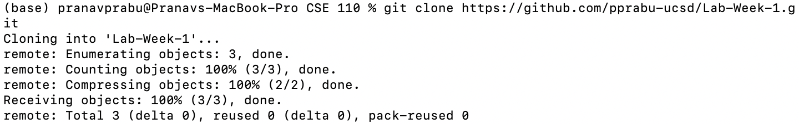
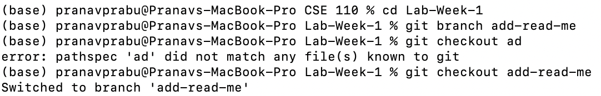
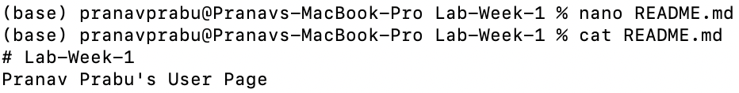
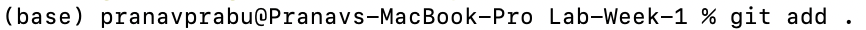
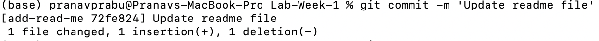
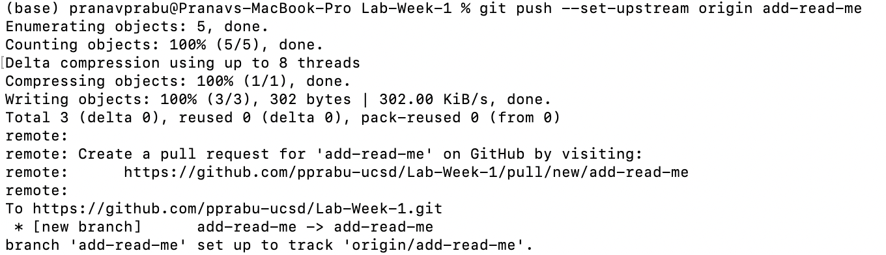
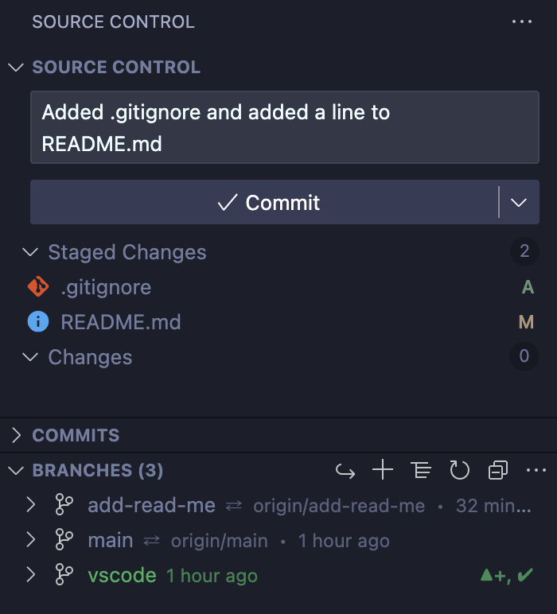

# User Page
## Name: Pranav Prabu
### PID: A17424120

[Go to Images](https://github.com/pprabu-ucsd/Lab-1/blob/main/index.md#pictures-and-relative-links)

I am an **avid programmer**, working with _ _several languages_ _ like ***Python, C, C++, Java, and more***. I love to read, but when programming, I have a tendency to kind of wing my assignments, leading to a lot of hassle at times. However, those experiences help me learn to be better with my time.

My favorite language is

> C++

However, the first programming language I learned was Java, using this [book](https://www.buildingjavaprograms.com/supplements3.shtml).

I feel like what defines me as a person is ```my perseverance and willingness to problem-solve.```

As a programmer I initially thought that the 3 most important steps were

- Syntax
- Runtime
- Completion

However, as I have grown in both technical ability as well as knowledge regarding programming, I have a much more accurate process (however this process is still changing):

1. Plan key elements
2. Examine runtime
3. Write pseudocode
4. Test out breaking the pseudocode
5. Identify repeating elements
6. Write code
7. Realize I thought about it wrong the whole time
8. Panic
9. Write it all from scratch without planning
10. Fix bugs for 3 hours
11. Have it somehow work even though I don't understand what I did

All jokes aside I feel like I've gotten more organized with how I code, but I can only tell with hindsight, so my perspective may change soon.

So far, Lab 1 is now done, but I can use this as a checklist for the remaining labs over the course of the quarter.

- [x] Lab 1
- [ ] Lab 2
- [ ] Lab 3
- [ ] Lab 4
- [ ] Lab 5
- [ ] Lab 6
- [ ] Lab 7
- [ ] Lab 8
- [ ] Lab 9
- [ ] Lab 10

#### Pictures and Relative Links

[git clone](screenshots/git_clone.jpg)


[Branch Setup](screenshots/git-branch.jpg)


[Adding Text](screenshots/nano.jpg)


[git add](screenshots/git-add.jpg)


[git commit](screenshots/git-commit.jpg)


[git push](screenshots/git-push.jpg)


[VSCode Portion of the Lab (.gitignore not in the main branch, but the vscode branch)](screenshots/vscode.jpg)


